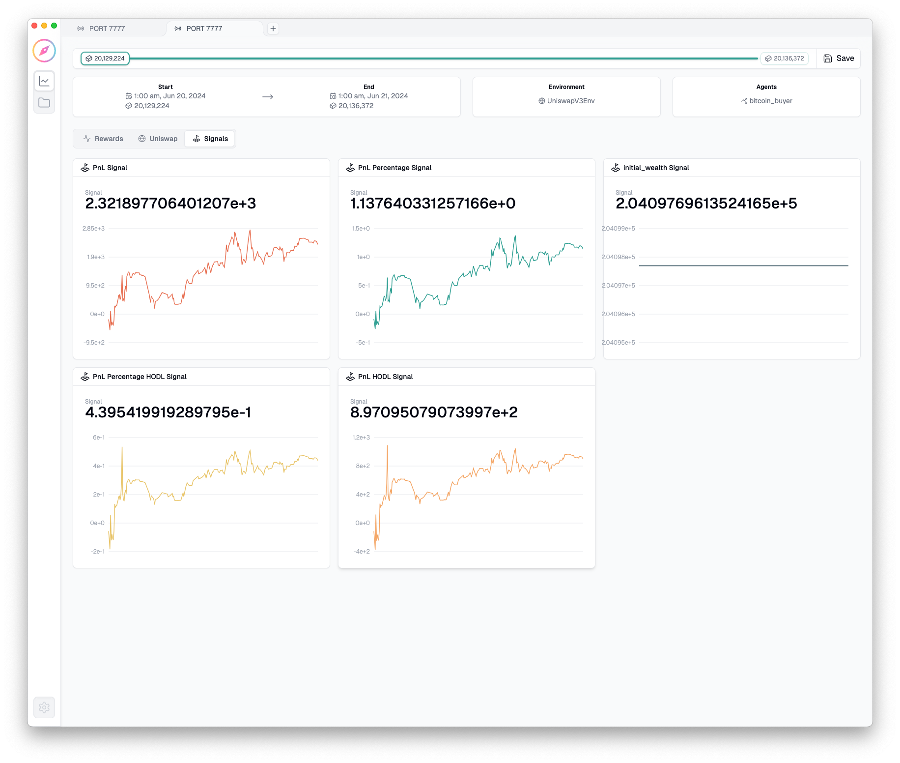
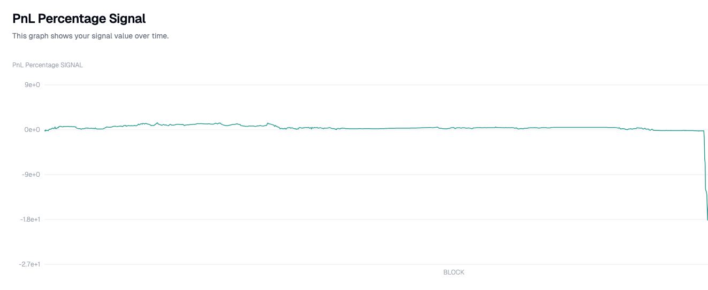
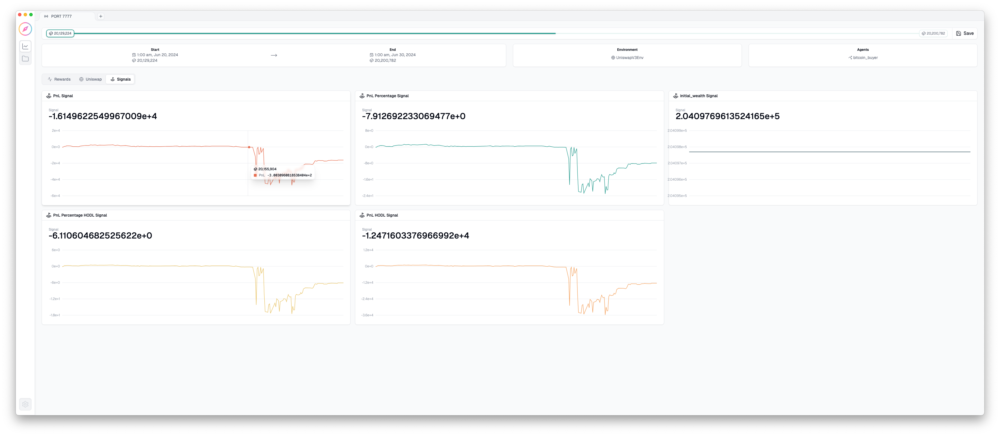

*This repo is my entry for the Compass Labs DeFi Trading competition in the 2024 Encode London Hackathon*
*It uses `dojo` a "Python-based DeFi platform for data sourcing, strategy development, backtesting, simulation, monitoring and execution" made by [Compass Labs](https://www.compasslabs.ai/docs) to make a trading bot*

# Simple WBTC-Holding Strategy


## 1. Detailed Description of the Trading Strategy
**Strategy Overview**: This policy is based on a maximalist belief in Bitcoin's long-term dominance as a store of value. The strategy is simple: buy Wrapped Bitcoin, hold it, and let time work its magic.

- **Entry Signal**: Automatically purchase Wrapped Bitcoin on uniswap.
- **Exit Signal**: No exit; Wrapped Bitcoin is held forever.

## 2. Code Submission (`policy.py`)
- Include code that:
    -  swaps all worthless non WBTC tokens in the portfolio for Wrapped Bitcoins.

## 3. Brief Explanation of Approach and Assumptions
- **Approach**: A straightforward, passive investment strategy with no timing considerations.
- **Assumptions**:
  - Bitcoin is expected to appreciate over time.
  - The user accepts potential market drawdowns.

## 4. Backtest Results with Performance Metrics
coming soon...

# To run:


```bash
python run.py
```

###  Dependencies

```bash
[tool.poetry.dependencies]
python = ">=3.12,<3.13"
dojo-compass = "^3.4.6"
colorama = "^0.4.6"
```

### Images:






<!---->


